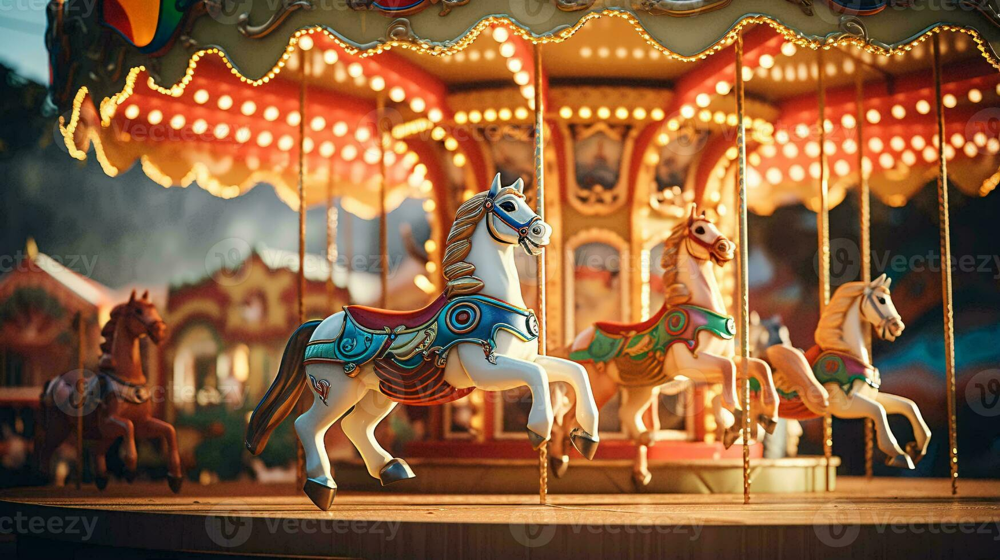
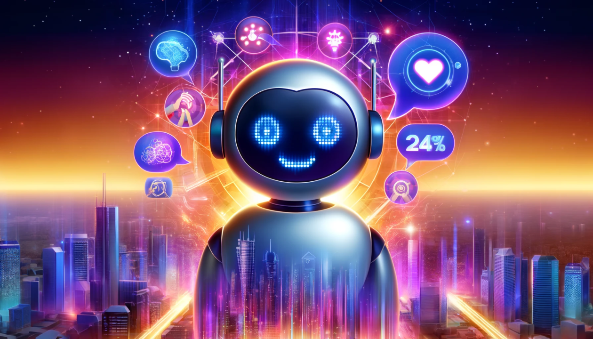

  
  
   
  <h1><b>AI Image Generator Tool</b></h1>
  
<i>Unleash your creativity with AI-powered image generation!</i>

  
  
  

---

## 📝 Description

 <b>AI Image Generator Tool</b> is a modern web application that lets you create stunning, unique images from your imagination using advanced AI models. Simply enter a prompt, and watch as the AI brings your ideas to life!

<ul>
  <li>✨ <b>Easy to use</b> — Clean, intuitive interface</li>
  <li>🔒 <b>Secure</b> — User authentication for your creations</li>
  <li>⚡ <b>Fast</b> — Instant image generation</li>
  <li>🎨 <b>Creative</b> — Endless possibilities</li>
</ul>

---

## ✨ Features

<table>
  <tr>
    <td>🧠 <b>AI-powered</b></td>
    <td>🎨 <b>Image Gallery</b></td>
    <td>🔐 <b>Authentication</b></td>
    <td>⚙️ <b>Easy UI</b></td>
    <td>☁️ <b>Cloud Deploy</b></td>
  </tr>
  <tr>
    <td align="center"></td>
    <td align="center"></td>
    <td align="center"></td>
    <td align="center"></td>
    <td align="center"></td>
  </tr>
</table>

---

## 📸 Screenshots

  
  

---

## 🛠️ Tech Stack

  
  
  
  
  
  
  

---

## ⚙️ Setup & Installation

<b>🛠️ Click to expand setup instructions</b>

1. <b>Clone the repository:</b>
    
   <code>git clone https://github.com/prem2708/Ai_image_generator_tool.git</code> 
   <code>cd Ai_image_generator_tool</code>
2. <b>Create a virtual environment & activate it:</b>
    
   <code>python -m venv venv</code> 
   <code>venv\Scripts\activate</code> <i>(Windows)</i> 
   <code>source venv/bin/activate</code> <i>(Mac/Linux)</i>
3. <b>Install dependencies:</b>
    
   <code>pip install -r requirements.txt</code>
4. <b>Run migrations:</b>
    
   <code>python ai_image/manage.py migrate</code>
5. <b>Start the server:</b>
    
   <code>python ai_image/manage.py runserver</code>
6. <b>Open in browser:</b>
    
   Visit <a href="http://127.0.0.1:8000/">http://127.0.0.1:8000/</a>

---

## 🧑‍💻 Usage

<ol>
  <li>📝 Register for a new account or log in.</li>
  <li>💡 Enter a prompt to generate an image using AI.</li>
  <li>🖼️ View, download, or share your generated images.</li>
</ol>

---

## 🌐 Deployment

 <b>Deployed on Railway</b>

---

## 🤝 Contributing

 <b>We welcome contributions!</b>

<ul>
  <li>⭐ Star this repo to support the project</li>
  <li>🐛 <b>Found a bug?</b> Open an issue</li>
  <li>🚀 <b>Want a feature?</b> Submit a pull request</li>
  <li>💬 <b>Questions?</b> Start a discussion</li>
</ul>

---

